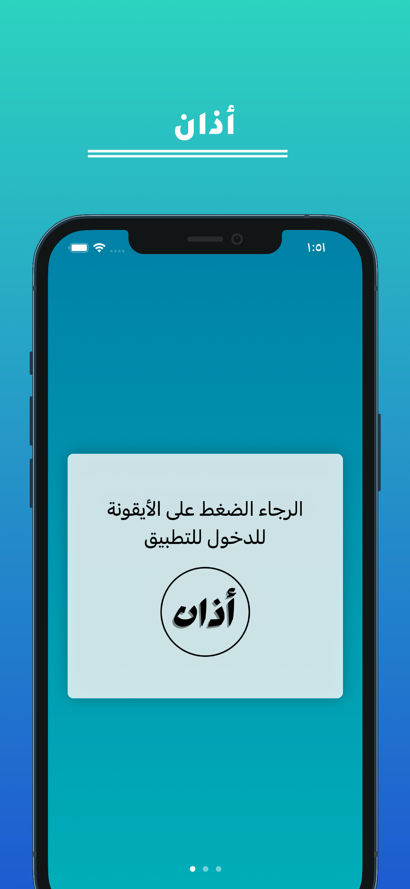
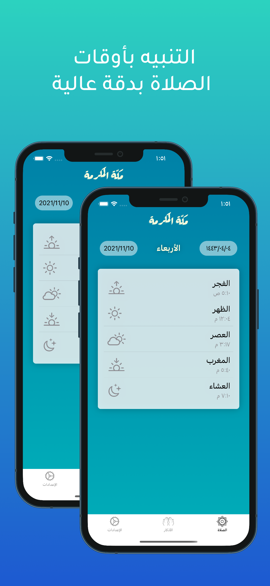
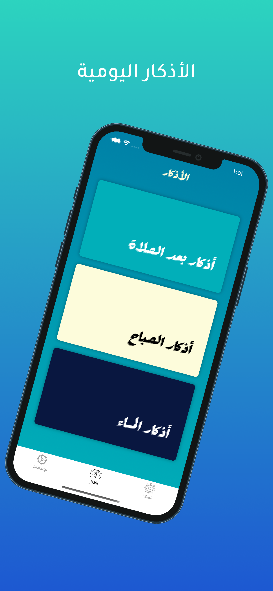
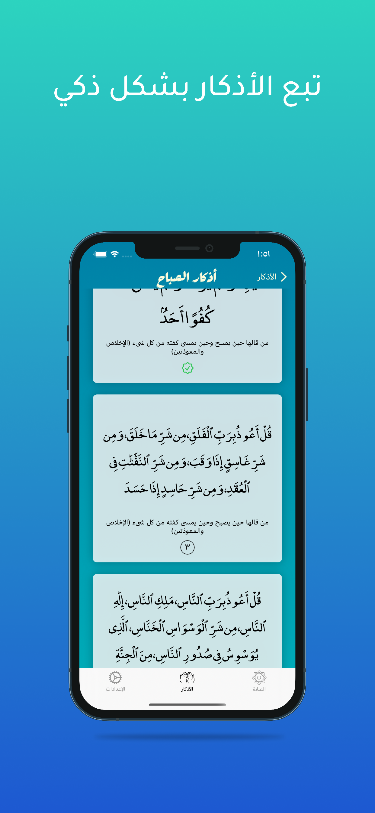

# AthanApp

<!-- PROJECT LOGO -->
 

  

  <h3 align="center">Athan</h3>

  

    An awesome Prayer time Reminder App
     
     
     
     
  

<!-- ABOUT THE PROJECT -->

## About The Project

  <table spacing = "10">
    <tr>
      
      
      
      
    </tr>
  </table>  

Athan app reminds you when the prayer time arrives with high accuracy. The app is free and open-source

Athan app does not depend on the Internet. It calculates prayer times based on very accurate calculations based on your geographical location
The application currently supports the Umm Al-Qura calendar only.

Main Features:

- Accurate prayer times
- Beautiful design and easy to use
- Prayer times alert
- Remembrances of morning and evening, prayer and sleep
- There are no ads in the application
- open source

### Supported Platforms

- iOS 15.0+

### Built With

Athan is built using native iOS Development by using Swift and Xcode and it uses MVVM architecture

Frameworks used

- [SwiftUI](https://developer.apple.com/xcode/swiftui/)
- [UIkit](https://developer.apple.com/documentation/uikit/)
- [UserNotifications](https://developer.apple.com/documentation/usernotifications)
- [CoreLocation](https://developer.apple.com/documentation/corelocation)

(<a href="#top">back to top</a>)

## Contact

Khalid Alhazmi - [@iKAlhazmi](https://twitter.com/iKAlhazmi) - Alhazmi@outlook.com
